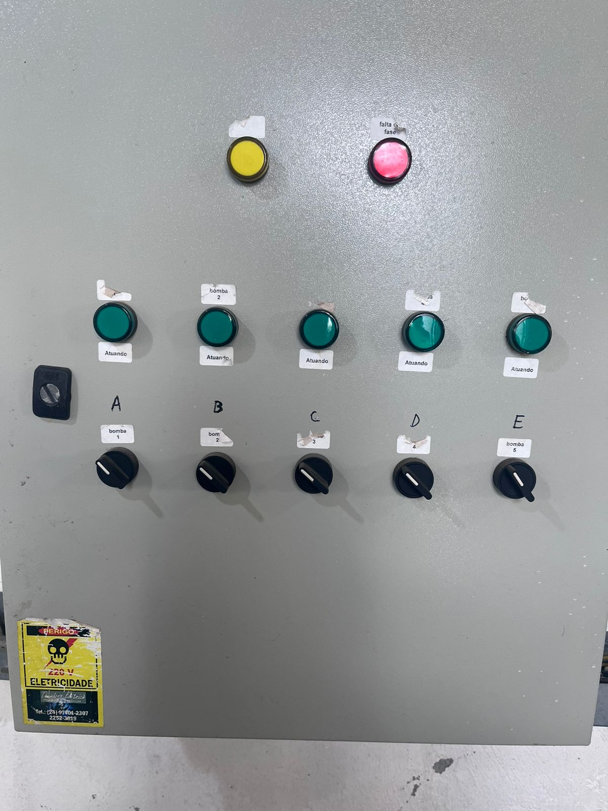
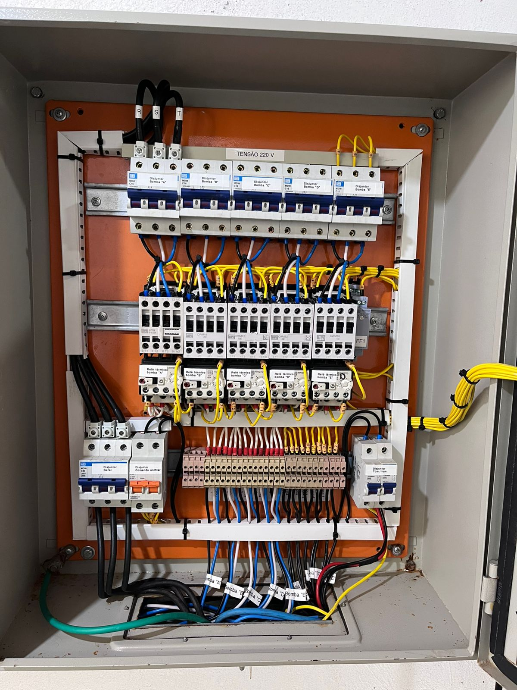

# 📋 EXPLICATIVO COMPLETO DO CÓDIGO - Leonardo Serviços Elétricos

## 🎯 VISÃO GERAL DO PROJETO

Este é um **portfólio profissional completo** para um eletricista, desenvolvido como uma **Single Page Application (SPA)** utilizando HTML5, CSS3 e JavaScript puro. O site apresenta todos os serviços oferecidos, galeria de trabalhos realizados, formulário de contato e integração com WhatsApp.

---

## 📁 ESTRUTURA GERAL DO ARQUIVO

```
index.html (1658 linhas)
├── <!DOCTYPE html> e <html>
├── <head> (Meta tags, CSS inline)
├── <body> (Conteúdo e JavaScript inline)
└── </html>
```

### **Características Técnicas:**
- **Arquivo único**: Todo código concentrado em um arquivo para máxima portabilidade
- **CSS Inline**: 600+ linhas de CSS incorporadas no <head>
- **JavaScript Inline**: 400+ linhas de JS no final do <body>
- **Responsivo**: Design que se adapta a desktop, tablet e mobile
- **Acessível**: Atende padrões de acessibilidade web

---

## 🏗️ SEÇÃO `<head>` - CONFIGURAÇÕES E METADADOS

### **1. Configurações Básicas**
```html
<!DOCTYPE html>
<html lang="pt-br">
<head>
  <meta charset="UTF-8">
  <meta name="viewport" content="width=device-width, initial-scale=1.0">
  <title>Leonardo Serviços Elétricos - Elétrica com Confiança</title>
```

**Explicação:**
- `DOCTYPE html`: Define documento HTML5
- `lang="pt-br"`: Idioma português brasileiro para SEO e acessibilidade
- `charset="UTF-8"`: Suporte a acentuação e caracteres especiais
- `viewport`: Configuração essencial para responsividade mobile

### **2. SEO e Meta Tags**
```html
<!-- SEO Meta Tags -->
<meta name="description" content="Leonardo Serviços Elétricos - Especialistas...">
<meta name="keywords" content="eletricista, serviços elétricos...">
<meta name="author" content="Leonardo Serviços Elétricos">
<meta name="robots" content="index, follow">

<!-- Open Graph / Facebook -->
<meta property="og:type" content="website">
<meta property="og:title" content="Leonardo Serviços Elétricos">
<meta property="og:description" content="Elétrica com confiança...">
```

**Explicação:**
- **SEO Meta Tags**: Ajudam mecanismos de busca a entender e indexar o site
- **Open Graph**: Configura como o site aparece quando compartilhado em redes sociais
- **robots**: Instrui buscadores a indexar (`index`) e seguir links (`follow`)

### **3. Recursos Externos**
```html
<!-- Fonts and Icons -->
<link href="https://fonts.googleapis.com/css2?family=Inter..." rel="stylesheet">
<link rel="stylesheet" href="https://cdn.jsdelivr.net/npm/@fortawesome...">

<!-- Favicon -->
<link rel="icon" href="data:image/svg+xml,<svg...">
```

**Explicação:**
- **Google Fonts**: Carrega fonte Inter para tipografia moderna
- **FontAwesome**: Biblioteca de ícones para botões e elementos visuais
- **Favicon**: Ícone de raio (⚡) que aparece na aba do navegador

---

## 🎨 SEÇÃO CSS - ESTILIZAÇÃO COMPLETA

### **4. Variáveis CSS (CSS Custom Properties)**
```css
:root {
  --azul: #5A7EBD;
  --azul-claro: #8CB9EA;
  --amarelo: #ffc93c;
  --cinza-bg: #f6f7fb;
  --verde-whatsapp: #25d366;
  /* ... mais variáveis */
}

body.dark-mode {
  --azul: #7DA6DE;
  --azul-claro: #A3CCE8;
  --cinza-bg: #1a1a1a;
  /* ... variáveis para modo escuro */
}
```

**Explicação:**
- **Variáveis CSS**: Centralizam cores e valores para facilitar manutenção
- **Modo Escuro**: Sobrescreve variáveis quando `body` tem classe `dark-mode`
- **Consistência**: Garantem que toda a interface use a mesma paleta de cores

### **5. Reset e Configurações Globais**
```css
html {
  scroll-behavior: smooth;
}

body {
  background: var(--cinza-bg);
  font-family: 'Inter', Arial, sans-serif;
  margin: 0;
  color: var(--texto);
  transition: all 0.3s ease;
  padding-top: 140px; /* Compensa header fixo */
}
```

**Explicação:**
- **scroll-behavior: smooth**: Navegação suave entre seções
- **padding-top**: Compensa altura do header fixo
- **transition**: Animações suaves em mudanças de tema

### **6. Header e Navegação**
```css
header {
  background: linear-gradient(90deg, var(--azul) 80%, var(--amarelo) 100%);
  padding: 20px 0;
  text-align: center;
  position: fixed; /* Fixo no topo */
  top: 0;
  width: 100%;
  z-index: 100;
  box-shadow: 0 2px 12px rgba(34, 68, 136, 0.15);
}
```

**Explicação:**
- **position: fixed**: Header sempre visível no topo
- **z-index: 100**: Fica acima de outros elementos
- **gradient**: Fundo degradê azul para amarelo
- **box-shadow**: Sombra sutil para destacar do conteúdo

### **7. Logo e Slogan**
```css
.header-logo {
  display: flex;
  align-items: center;
  justify-content: center;
  gap: 20px;
  margin-bottom: 5px;
}

.slogan-img {
  max-width: 80px;
  height: auto;
  border-radius: 10px;
  box-shadow: 0 2px 8px rgba(0, 0, 0, 0.1);
  display: block;
  object-fit: contain;
}
```

**Explicação:**
- **Flexbox**: Alinha logo e texto horizontalmente
- **object-fit: contain**: Mantém proporção da imagem
- **border-radius**: Cantos arredondados na imagem

### **8. Menu Dropdown**
```css
.dropdown {
  position: relative;
  display: inline-block;
}

.dropdown-content {
  display: none;
  position: absolute;
  background-color: var(--branco);
  min-width: 200px;
  box-shadow: 0 8px 24px rgba(0, 0, 0, 0.15);
  z-index: 1001;
  left: 50%;
  transform: translateX(-50%);
  top: 100%;
  border-radius: 12px;
  padding: 15px 0;
  border: 1px solid var(--borda);
  animation: slideDown 0.3s ease;
}

.dropdown:hover .dropdown-content {
  display: block;
}
```

**Explicação:**
- **position: absolute**: Dropdown posicionado relativo ao botão
- **transform: translateX(-50%)**: Centraliza dropdown
- **animation: slideDown**: Animação de entrada suave
- **:hover**: Mostra dropdown ao passar mouse

### **9. Hero Section (Seção Principal)**
```css
.hero-section {
  text-align: center;
  padding: 60px 20px 40px 20px;
  margin-bottom: 50px;
  background: linear-gradient(135deg, var(--cinza-box) 0%, var(--branco) 100%);
  border-radius: 15px;
  min-height: calc(100vh - 140px);
  box-sizing: border-box;
  display: flex;
  flex-direction: column;
  justify-content: center;
  align-items: center;
}
```

**Explicação:**
- **calc(100vh - 140px)**: Altura dinâmica que compensa header
- **flexbox**: Centraliza conteúdo vertical e horizontalmente
- **gradient**: Fundo degradê sutil
- **border-radius**: Cantos arredondados

### **10. Cards de Serviços**
```css
.service-cards-container {
  display: grid;
  grid-template-columns: repeat(auto-fit, minmax(280px, 1fr));
  gap: 25px;
  margin-top: 30px;
  margin-bottom: 40px;
}

.service-card {
  background: var(--cinza-box);
  padding: 25px;
  border-radius: 10px;
  box-shadow: 0 4px 15px rgba(0, 0, 0, 0.08);
  text-align: center;
  transition: transform 0.2s ease, box-shadow 0.2s ease;
  display: flex;
  flex-direction: column;
  justify-content: space-between;
}

.service-card:hover {
  transform: translateY(-5px);
  box-shadow: 0 8px 25px rgba(0, 0, 0, 0.12);
}
```

**Explicação:**
- **CSS Grid**: Layout responsivo automático
- **auto-fit**: Ajusta colunas conforme espaço disponível
- **minmax(280px, 1fr)**: Largura mínima e máxima dos cards
- **transform: translateY(-5px)**: Efeito de elevação no hover
- **flexbox**: Distribui conteúdo interno do card

### **11. Galeria de Imagens**
```css
.gallery-container {
  display: flex;
  flex-wrap: wrap;
  justify-content: center;
  gap: 15px;
  margin-top: 22px;
  margin-bottom: 25px;
}

.gallery-item {
  cursor: pointer;
  border: none;
  background: none;
  padding: 0;
  position: relative;
  overflow: hidden;
  display: inline-block;
  transition: transform 0.3s ease, box-shadow 0.3s ease;
  width: 150px;
  height: 100px;
  border-radius: 8px;
  box-shadow: 0 4px 10px rgba(0, 0, 0, 0.1);
}

.gallery-item img {
  width: 100%;
  height: 100%;
  object-fit: cover;
  border-radius: 8px;
  transition: transform 0.3s ease;
}

.gallery-item:hover {
  transform: translateY(-5px);
  box-shadow: 0 10px 25px rgba(0, 0, 0, 0.2);
}

.gallery-item:hover img {
  transform: scale(1.05);
}
```

**Explicação:**
- **Flexbox**: Organiza miniaturas em linha flexível
- **object-fit: cover**: Imagens preenchem área mantendo proporção
- **overflow: hidden**: Esconde partes da imagem que extrapolam
- **Dimensões fixas**: width: 150px, height: 100px para uniformidade
- **Efeitos hover**: Elevação e zoom suaves

### **12. Correções de Orientação das Imagens**
```css
/* Correção de orientação para imagens específicas */
.img-rotate-90 {
  transform: rotate(90deg) !important;
}

.img-rotate-270 {
  transform: rotate(270deg) !important;
}

.gallery-item:hover .img-rotate-90 {
  transform: rotate(90deg) scale(1.05) !important;
}

.gallery-item:hover .img-rotate-270 {
  transform: rotate(270deg) scale(1.05) !important;
}

/* Rotação no modal também */
.modal-content.img-rotate-90 {
  transform: rotate(90deg) !important;
}

.modal-content.img-rotate-270 {
  transform: rotate(270deg) !important;
}

/* Classe para diminuir tamanho específico das fotos depois2 e depois3 */
.img-small {
  transform: scale(0.7) !important;
}

.img-rotate-270.img-small {
  transform: rotate(270deg) scale(0.7) !important;
}

.gallery-item:hover .img-rotate-270.img-small {
  transform: rotate(270deg) scale(0.75) !important;
}

.modal-content.img-rotate-270.img-small {
  transform: rotate(270deg) scale(0.8) !important;
}
```

**Explicação:**
- **Classes modulares**: Permitem aplicar rotação e escala independentemente
- **!important**: Garante prioridade sobre outros estilos
- **Combinação de transforms**: Rotação + escala + hover
- **Especificidade crescente**: Cada estado tem sua regra específica

### **13. Modal (Lightbox)**
```css
.modal {
  display: none;
  position: fixed;
  z-index: 10000;
  left: 0;
  top: 0;
  width: 100%;
  height: 100%;
  background-color: rgba(0, 0, 0, 0.9);
  backdrop-filter: blur(5px);
  align-items: center;
  justify-content: center;
}

.modal.show {
  display: flex;
  animation: fadeIn 0.3s ease;
}

.modal-content {
  max-width: 90%;
  max-height: 80%;
  object-fit: contain;
  border-radius: 10px;
  box-shadow: 0 10px 30px rgba(0, 0, 0, 0.5);
  animation: zoomIn 0.3s ease;
}
```

**Explicação:**
- **position: fixed**: Cobre toda a tela
- **z-index: 10000**: Fica acima de todos os elementos
- **backdrop-filter: blur(5px)**: Desfoque do fundo
- **flexbox**: Centraliza imagem ampliada
- **object-fit: contain**: Mantém proporção da imagem

### **14. Setas de Navegação do Modal**
```css
.prev, .next {
  cursor: pointer;
  position: absolute;
  top: 50%;
  width: auto;
  padding: 16px;
  margin-top: -22px;
  color: white;
  font-weight: bold;
  font-size: 30px;
  transition: 0.3s ease;
  border-radius: 0 3px 3px 0;
  user-select: none;
  background-color: rgba(0, 0, 0, 0.5);
}

.next {
  right: 0;
  border-radius: 3px 0 0 3px;
}

.prev {
  left: 0;
  border-radius: 0 3px 3px 0;
}

.prev:hover, .next:hover {
  background-color: rgba(0, 0, 0, 0.8);
}
```

**Explicação:**
- **position: absolute**: Posicionamento livre dentro do modal
- **top: 50%**: Centraliza verticalmente
- **left: 0 / right: 0**: Posiciona nas extremidades
- **user-select: none**: Previne seleção de texto
- **border-radius**: Cantos arredondados apenas internos

### **15. Modal de Serviços**
```css
.modal-content-service {
  background-color: var(--branco);
  margin: auto;
  padding: 40px;
  border-radius: 15px;
  box-shadow: 0 10px 40px rgba(0, 0, 0, 0.25);
  max-width: 600px;
  width: 90%;
  position: relative;
  animation: zoomIn 0.3s ease;
  color: var(--texto);
}

.close-button-service {
  color: var(--azul);
  position: absolute;
  top: 15px;
  right: 25px;
  font-size: 35px;
  font-weight: bold;
  transition: 0.3s;
  cursor: pointer;
}
```

**Explicação:**
- **Dimensões responsivas**: max-width + width para flexibilidade
- **position: relative**: Permite posicionamento absoluto do botão fechar
- **animation: zoomIn**: Animação de entrada
- **color: var(--texto)**: Usa variável CSS para tema

### **16. Formulário de Contato**
```css
#fale-conosco-form {
  margin-top: 60px;
  background: linear-gradient(135deg, var(--azul) 0%, var(--azul-claro) 100%);
  padding: 50px 0;
  border-radius: 20px;
  text-align: center;
}

.orcamento-form {
  max-width: 600px;
  margin: 0 auto;
  background: var(--branco);
  padding: 40px;
  border-radius: 15px;
  box-shadow: 0 8px 30px rgba(0, 0, 0, 0.15);
  text-align: left;
}

.form-group {
  margin-bottom: 25px;
}

.form-group input,
.form-group select,
.form-group textarea {
  width: 100%;
  padding: 12px 15px;
  border: 2px solid var(--borda);
  border-radius: 8px;
  font-size: 1rem;
  background: var(--branco);
  color: var(--texto);
  transition: all 0.3s ease;
  box-sizing: border-box;
}

.form-group input:focus,
.form-group select:focus,
.form-group textarea:focus {
  border-color: var(--azul);
  outline: none;
  box-shadow: 0 0 0 3px rgba(90, 126, 189, 0.1);
}
```

**Explicação:**
- **Gradient de fundo**: Destaca seção do formulário
- **box-sizing: border-box**: Inclui padding na largura total
- **transition**: Animações suaves nos estados
- **focus**: Estados visuais para acessibilidade
- **box-shadow no focus**: Feedback visual discreto

### **17. Botões do Formulário**
```css
.btn-submit,
.btn-whatsapp,
.ligar-btn-form {
  background: var(--azul);
  color: var(--branco);
  padding: 15px 25px;
  border: none;
  border-radius: 8px;
  font-size: 1.1rem;
  font-weight: 600;
  cursor: pointer;
  transition: all 0.3s ease;
  display: flex;
  align-items: center;
  justify-content: center;
  gap: 10px;
  text-decoration: none;
  width: 100%;
  box-sizing: border-box;
  text-align: center;
}

.btn-whatsapp {
  background: var(--verde-whatsapp);
}

.ligar-btn-form {
  background: var(--amarelo);
  color: var(--azul);
}
```

**Explicação:**
- **Flexbox**: Alinha ícone e texto nos botões
- **width: 100%**: Botões ocupam largura total
- **gap: 10px**: Espaçamento entre ícone e texto
- **Cores específicas**: Cada botão tem sua identidade visual

### **18. Elementos Flutuantes**
```css
.whatsapp-float {
  position: fixed;
  width: 60px;
  height: 60px;
  bottom: 25px;
  right: 25px;
  background: var(--verde-whatsapp);
  color: white;
  border-radius: 50%;
  box-shadow: 0 4px 20px rgba(37, 211, 102, 0.3);
  display: flex;
  align-items: center;
  justify-content: center;
  z-index: 999;
  font-size: 1.8rem;
  transition: all 0.3s ease;
  cursor: pointer;
  text-decoration: none;
}

#dark-mode-toggle {
  position: fixed;
  top: 20px;
  right: 20px;
  background: var(--azul);
  color: var(--branco);
  border: none;
  border-radius: 50%;
  width: 50px;
  height: 50px;
  display: flex;
  align-items: center;
  justify-content: center;
  font-size: 1.2rem;
  cursor: pointer;
  z-index: 1000;
  box-shadow: 0 4px 12px rgba(0, 0, 0, 0.15);
  transition: all 0.3s ease;
}
```

**Explicação:**
- **position: fixed**: Permanecem fixos durante scroll
- **border-radius: 50%**: Formato circular
- **z-index**: Valores diferentes para hierarquia
- **box-shadow com cor**: Sombra colorida para WhatsApp

### **19. Responsividade**
```css
@media (max-width: 768px) {
  body {
    padding-top: 170px;
  }

  header {
    padding: 15px;
  }

  .header-logo {
    flex-direction: column;
    gap: 10px;
  }

  .slogan-img {
    max-width: 60px;
    min-width: 40px;
    width: 60px;
    height: auto;
    margin: 0 auto;
    display: block !important;
    visibility: visible !important;
    opacity: 1 !important;
  }

  h1 {
    font-size: 1.8rem;
  }

  nav {
    gap: 15px;
  }

  nav a,
  .dropdown .dropbtn {
    padding: 8px 15px;
    font-size: 0.9rem;
  }
}

@media (max-width: 480px) {
  .slogan-img {
    max-width: 50px;
    min-width: 35px;
    width: 50px;
    height: auto;
    margin: 0 auto;
    display: block !important;
    visibility: visible !important;
    opacity: 1 !important;
  }
}
```

**Explicação:**
- **Breakpoints**: 768px (tablet) e 480px (mobile)
- **flex-direction: column**: Logo empilhado em mobile
- **padding-top ajustado**: Compensa header maior em mobile
- **!important**: Força exibição da imagem do slogan
- **Tamanhos escalonados**: Fontes e elementos menores

### **20. Animações CSS**
```css
@keyframes fadeIn {
  from {
    opacity: 0;
    transform: translateY(20px);
  }
  to {
    opacity: 1;
    transform: translateY(0);
  }
}

@keyframes zoomIn {
  from {
    transform: scale(0.8);
    opacity: 0;
  }
  to {
    transform: scale(1);
    opacity: 1;
  }
}

@keyframes slideDown {
  from {
    opacity: 0;
    transform: translateX(-50%) translateY(-10px);
  }
  to {
    opacity: 1;
    transform: translateX(-50%) translateY(0);
  }
}
```

**Explicação:**
- **@keyframes**: Define animações personalizadas
- **fadeIn**: Entrada suave com movimento vertical
- **zoomIn**: Entrada com escala para modais
- **slideDown**: Movimento específico para dropdown

---

## 🏗️ SEÇÃO `<body>` - ESTRUTURA HTML

### **21. Botão de Modo Escuro**
```html
<button id="dark-mode-toggle" aria-label="Alternar modo escuro">
  <i class="fas fa-moon"></i>
</button>
```

**Explicação:**
- **aria-label**: Acessibilidade para leitores de tela
- **FontAwesome**: Ícone da lua que muda para sol
- **id único**: Para manipulação via JavaScript

### **22. Header e Navegação**
```html
<header>
  <div class="header-logo">
    
    <div>
      <h1>Leonardo Serviços Elétricos</h1>
      <p>Elétrica com confiança e responsabilidade!</p>
    </div>
  </div>
  <nav>
    <a href="#home">Home</a>
    <a href="#quem-somos-section">Quem Somos</a>
    <div class="dropdown">
      <button class="dropbtn">Serviços <i class="fas fa-chevron-down"></i></button>
      <div class="dropdown-content">
        <a href="#instalacoes-residenciais">Instalações Residenciais</a>
        <a href="#manutencao">Manutenção</a>
        <a href="#iluminacao">Iluminação</a>
        <a href="#quadros-disjuntores">Quadros e Disjuntores</a>
        <a href="#tomadas-interruptores">Tomadas e Interruptores</a>
        <a href="#ventiladores-teto">Ventiladores de Teto</a>
      </div>
    </div>
    <a href="#fale-conosco-form">Fale Conosco</a>
  </nav>
</header>
```

**Explicação:**
- **loading="eager"**: Carrega logo prioritariamente
- **Alt descritivo**: Importante para SEO e acessibilidade
- **Estrutura semântica**: `<header>`, `<nav>` para navegação
- **Links de âncora**: Navegação interna suave
- **Dropdown estruturado**: Botão + conteúdo escondido

### **23. Seção Hero**
```html
<main>
  <section id="home" class="hero-section">
    <div class="hero-content">
      <h2 class="eletricista-conf-mobile">Seu Eletricista de Confiança</h2>
      <p>Garantimos soluções elétricas eficientes e seguras para sua casa ou empresa. 
         Conte com nossa expertise para uma instalação perfeita e manutenções de qualidade.</p>
    </div>
  </section>
```

**Explicação:**
- **`<main>`**: Conteúdo principal da página
- **id="home"**: Âncora para navegação
- **Hierarquia de títulos**: h1 no header, h2 na seção
- **Texto persuasivo**: Destaca benefícios e confiança

### **24. Cards de Serviços**
```html
<div class="service-cards-container">
  <div class="service-card">
    <i class="fas fa-home"></i>
    <h3 id="instalacoes-residenciais">Instalações Residenciais</h3>
    <p>Realizamos toda a instalação elétrica para sua nova casa ou reforma...</p>
    <a href="#" class="btn-saiba-mais" data-service="instalacoes-residenciais">Saiba Mais</a>
  </div>
  <!-- Mais cards... -->
</div>
```

**Explicação:**
- **data-service**: Atributo personalizado para JavaScript
- **FontAwesome icons**: Ícones temáticos para cada serviço
- **id nas âncoras**: Permitem navegação direta
- **Estrutura consistente**: Ícone → Título → Descrição → Botão

### **25. Galeria de Imagens**
```html
<div class="gallery-container">
  <button class="gallery-item" aria-label="Visualizar imagem - Antes">
    
  </button>
  <button class="gallery-item" aria-label="Visualizar imagem - Depois">
    
  </button>
  <!-- Mais imagens... -->
</div>
```

**Explicação:**
- **`<button>` como container**: Melhor acessibilidade
- **data-index**: Índice para navegação no modal
- **aria-label**: Descrição para leitores de tela
- **Classes modulares**: img-rotate-270 + img-small
- **Alt descritivo**: Descreve conteúdo da imagem

### **26. Vídeo Responsivo**
```html
<aside aria-labelledby="video-heading">
  <h3 id="video-heading" style="text-align: center;">Veja Nosso Trabalho em Ação!</h3>
  <div class="video-responsive">
    <iframe width="100%" height="315"
      src="https://www.youtube.com/embed/pC94Rhea4qQ?autoplay=1&loop=1&playlist=pC94Rhea4qQ"
      title="YouTube video player" frameborder="0"
      allow="accelerometer; autoplay; clipboard-write; encrypted-media; gyroscope; picture-in-picture"
      allowfullscreen>
    </iframe>
  </div>
  <p style="text-align: center; margin-top: 20px;">
    Este vídeo demonstra um pouco da qualidade e dedicação que aplicamos em nossos serviços.
  </p>
</aside>
```

**Explicação:**
- **aria-labelledby**: Conecta título ao conteúdo
- **Container responsivo**: Mantém proporção 16:9
- **Parâmetros YouTube**: autoplay, loop, playlist
- **allow attributes**: Permissões específicas do iframe
- **allowfullscreen**: Permite tela cheia

### **27. Formulário de Contato**
```html
<section id="fale-conosco-form">
  <h2>Solicite seu Orçamento</h2>
  <p class="form-subtitle">Preencha o formulário e receba uma proposta personalizada</p>

  <form class="orcamento-form" id="orcamentoForm" action="https://formspree.io/f/mdkdezre" method="POST">
    <div class="success-message" id="successMessage">
      <i class="fas fa-check-circle"></i> Solicitação enviada com sucesso!
    </div>

    <div class="error-message" id="errorMessage">
      <i class="fas fa-exclamation-circle"></i> Erro ao enviar solicitação.
    </div>

    <div class="form-group">
      <label for="nome">Nome Completo</label>
      <input type="text" id="nome" name="nome" placeholder="Seu nome completo" required>
    </div>

    <div class="form-group">
      <label for="email">Email</label>
      <input type="email" id="email" name="email" placeholder="seu@email.com" required>
    </div>

    <div class="form-group">
      <label for="telefone">Telefone</label>
      <input type="tel" id="telefone" name="telefone" placeholder="(11) 99999-9999" required>
    </div>

    <div class="form-group">
      <label for="tipoServico">Tipo de Serviço</label>
      <select id="tipoServico" name="tipoServico" required>
        <option value="">Selecione o serviço</option>
        <option value="instalacao-completa">Instalação Elétrica Completa</option>
        <option value="reforma">Reforma Elétrica</option>
        <!-- Mais opções... -->
      </select>
    </div>

    <div class="emergency-checkbox">
      <input type="checkbox" id="emergencia" name="emergencia" value="sim">
      <label for="emergencia">Este é um caso de emergência (atendimento prioritário)</label>
    </div>

    <div class="form-buttons">
      <button type="submit" class="btn-submit">
        <i class="fas fa-paper-plane"></i> Enviar Solicitação
      </button>
      <a href="tel:24981715411" class="ligar-btn-form">
        <i class="fas fa-phone-alt"></i> Ligar
      </a>
      <a href="#" class="btn-whatsapp" id="whatsappBtn">
        <i class="fab fa-whatsapp"></i> Enviar via WhatsApp
      </a>
    </div>
  </form>
</section>
```

**Explicação:**
- **action="formspree"**: Serviço de processamento de formulário
- **method="POST"**: Método HTTP para envio
- **required**: Validação HTML5 nativa
- **type específicos**: email, tel para validação
- **Mensagens de feedback**: success/error escondidas inicialmente
- **Multiple submission options**: Email, telefone, WhatsApp

### **28. Modais**
```html
<!-- Modal de Imagem -->
<div id="imageModal" class="modal">
  <span class="close-modal">&times;</span>
  
  <a class="prev" onclick="changeImage(-1)">&#10094;</a>
  <a class="next" onclick="changeImage(1)">&#10095;</a>
</div>

<!-- Modal de Serviço -->
<div id="serviceModal" class="modal">
  <div class="modal-content-service">
    <span class="close-button-service">&times;</span>
    <div id="serviceModalContent">
      <!-- Content will be dynamically inserted -->
    </div>
  </div>
</div>
```

**Explicação:**
- **Símbolos HTML**: &#10094; (◀) e &#10095; (▶) para setas
- **onclick inline**: Navegação direta (será substituída por listeners)
- **Conteúdo dinâmico**: serviceModalContent preenchido via JavaScript
- **Estruturas diferentes**: Modal de imagem vs modal de serviço

---

## ⚙️ SEÇÃO JAVASCRIPT - FUNCIONALIDADES INTERATIVAS

### **29. Estrutura Geral do JavaScript**
```javascript
document.addEventListener('DOMContentLoaded', function () {
  // Todo código JavaScript executa após DOM carregado
});
```

**Explicação:**
- **DOMContentLoaded**: Aguarda HTML ser totalmente carregado
- **Função anônima**: Encapsula todo código para evitar conflitos
- **Escopo protegido**: Variáveis não vazam para escopo global

### **30. Modo Escuro (Dark Mode)**
```javascript
// Verificação e tratamento da imagem do slogan
const sloganImg = document.querySelector('.slogan-img');
if (sloganImg) {
  sloganImg.onerror = function() {
    console.log('Erro ao carregar imagem do slogan, tentando caminho alternativo');
    this.src = 'imagens/slogan.jpeg'; // Fallback sem ./
    this.onerror = function() {
      console.log('Erro ao carregar imagem do slogan - usando fallback texto');
      this.style.display = 'none';
      const fallbackIcon = document.createElement('div');
      fallbackIcon.innerHTML = '⚡';
      fallbackIcon.style.cssText = 'font-size: 60px; color: #ffc93c; margin: 0 auto;';
      this.parentNode.insertBefore(fallbackIcon, this);
    };
  };
}

// JavaScript para o modo escuro
const darkModeToggle = document.getElementById('dark-mode-toggle');
const body = document.body;

darkModeToggle.addEventListener('click', () => {
  body.classList.toggle('dark-mode');
  const icon = darkModeToggle.querySelector('i');
  if (body.classList.contains('dark-mode')) {
    icon.classList.remove('fa-moon');
    icon.classList.add('fa-sun');
    localStorage.setItem('dark-mode', 'enabled');
  } else {
    icon.classList.remove('fa-sun');
    icon.classList.add('fa-moon');
    localStorage.setItem('dark-mode', 'disabled');
  }
});

// Verifica estado salvo
if (localStorage.getItem('dark-mode') === 'enabled') {
  body.classList.add('dark-mode');
  const icon = darkModeToggle.querySelector('i');
  icon.classList.remove('fa-moon');
  icon.classList.add('fa-sun');
}
```

**Explicação:**
- **Fallback de imagem**: Sistema de recuperação em cascata
- **classList.toggle()**: Adiciona/remove classe CSS
- **localStorage**: Persiste preferência do usuário
- **Troca de ícones**: FontAwesome moon ↔ sun
- **Estado inicial**: Restaura preferência salva

### **31. Modal de Galeria de Imagens**
```javascript
// Galeria de imagens
const modal = document.getElementById('imageModal');
const modalImg = document.getElementById('modalImage');
const closeModal = document.querySelector('.close-modal');
const galleryItems = document.querySelectorAll('.gallery-item img');
let currentImageIndex = 0;

const images = [
  'imagens/antes.jpeg',
  'imagens/antes1.jpeg',
  'imagens/antes2.jpeg',
  'imagens/depois.jpeg',
  'imagens/depois1.jpeg',
  'imagens/depois2.jpeg',
  'imagens/depois3.jpeg',
  'imagens/foto8-2.jpeg',
  'imagens/foto8-3.jpeg'
];

galleryItems.forEach((img, index) => {
  img.parentElement.addEventListener('click', () => {
    modal.classList.add('show');
    modalImg.src = img.src;
    modalImg.alt = img.alt;
    currentImageIndex = index;

    // Aplicar rotação no modal se a imagem original tem classe de rotação
    modalImg.className = 'modal-content'; // Reset classes
    if (img.classList.contains('img-rotate-90')) {
      modalImg.classList.add('img-rotate-90');
    } else if (img.classList.contains('img-rotate-270')) {
      modalImg.classList.add('img-rotate-270');
    }
    
    // Aplicar tamanho pequeno se a imagem original tem classe img-small
    if (img.classList.contains('img-small')) {
      modalImg.classList.add('img-small');
    }
  });
});

// Navigation arrows for modal
function changeImage(direction) {
  currentImageIndex += direction;

  if (currentImageIndex >= images.length) {
    currentImageIndex = 0;
  } else if (currentImageIndex < 0) {
    currentImageIndex = images.length - 1;
  }

  modalImg.src = images[currentImageIndex];

  // Aplicar rotação baseada na imagem atual
  const currentImg = galleryItems[currentImageIndex];
  modalImg.className = 'modal-content'; // Reset classes
  if (currentImg.classList.contains('img-rotate-90')) {
    modalImg.classList.add('img-rotate-90');
  } else if (currentImg.classList.contains('img-rotate-270')) {
    modalImg.classList.add('img-rotate-270');
  }
  
  // Aplicar tamanho pequeno se a imagem atual tem classe img-small
  if (currentImg.classList.contains('img-small')) {
    modalImg.classList.add('img-small');
  }
}
```

**Explicação:**
- **Array de imagens**: Lista ordenada para navegação
- **forEach**: Adiciona listener a cada miniatura
- **currentImageIndex**: Controla posição atual
- **Reset de classes**: Limpa estilos antes de aplicar novos
- **Preservação de transforms**: Mantém rotação e escala
- **Navegação circular**: Volta ao início/fim automaticamente

### **32. Navegação por Teclado**
```javascript
// Keyboard navigation
document.addEventListener('keydown', (e) => {
  if (modal.classList.contains('show')) {
    if (e.key === 'ArrowLeft') {
      changeImage(-1);
    } else if (e.key === 'ArrowRight') {
      changeImage(1);
    } else if (e.key === 'Escape') {
      modal.classList.remove('show');
    }
  }
});
```

**Explicação:**
- **Event listener global**: Escuta teclado em toda página
- **Verificação de estado**: Só funciona com modal aberto
- **Teclas de seta**: ← → para navegação
- **Escape**: Fecha modal (padrão de UX)

### **33. Modal de Serviços**
```javascript
// Service Modal
const serviceButtons = document.querySelectorAll('.btn-saiba-mais');
const serviceModal = document.getElementById('serviceModal');
const serviceModalContent = document.getElementById('serviceModalContent');
const closeServiceModal = document.querySelector('.close-button-service');

const serviceDetails = {
  'instalacoes-residenciais': {
    title: 'Instalações Residenciais',
    description: 'Realizamos toda a instalação elétrica para sua nova casa ou reforma...'
  },
  'manutencao': {
    title: 'Manutenção Elétrica',
    description: 'Oferecemos serviços completos de manutenção preventiva e corretiva...'
  },
  // Mais serviços...
};

serviceButtons.forEach(button => {
  button.addEventListener('click', (e) => {
    e.preventDefault();
    const serviceId = button.dataset.service;
    const service = serviceDetails[serviceId];
    
    if (service) {
      serviceModalContent.innerHTML = `
        <h3>${service.title}</h3>
        <p>${service.description}</p>
        <a href="#contato" class="btn-submit" onclick="closeServiceModalHandler()">
          <i class="fas fa-envelope"></i> Solicitar Orçamento
        </a>
      `;
      serviceModal.classList.add('show');
    }
  });
});
```

**Explicação:**
- **data attributes**: `dataset.service` acessa `data-service`
- **Objeto de configuração**: Centraliza conteúdo dos serviços
- **Template literals**: `` para HTML dinâmico
- **preventDefault()**: Evita comportamento padrão do link
- **innerHTML**: Injeta conteúdo dinamicamente

### **34. Fechamento de Modais**
```javascript
closeModal.addEventListener('click', () => {
  modal.classList.remove('show');
});

closeServiceModal.addEventListener('click', () => {
  serviceModal.classList.remove('show');
});

serviceModal.addEventListener('click', (e) => {
  if (e.target === serviceModal) {
    serviceModal.classList.remove('show');
  }
});

modal.addEventListener('click', (e) => {
  if (e.target === modal) {
    modal.classList.remove('show');
  }
});

function closeServiceModalHandler() {
  serviceModal.classList.remove('show');
}
```

**Explicação:**
- **Multiple ways to close**: X button, outside click, escape
- **Event target**: `e.target === modal` detecta clique no fundo
- **Function handler**: Para botões inline onclick

### **35. Scroll Suave para Âncoras**
```javascript
// Smooth scrolling para links de âncora
document.querySelectorAll('a[href^="#"]').forEach(anchor => {
  anchor.addEventListener('click', function (e) {
    const href = this.getAttribute('href');
    const targetElement = document.querySelector(href);
    if (targetElement) {
      e.preventDefault();
      const headerHeight = document.querySelector('header').offsetHeight;
      const offsetPosition = targetElement.offsetTop - headerHeight - 20;
      window.scrollTo({ top: offsetPosition, behavior: 'smooth' });
    }
  });
});
```

**Explicação:**
- **Seletor específico**: `a[href^="#"]` pega links de âncora
- **offsetHeight**: Altura dinâmica do header
- **offsetTop**: Posição do elemento alvo
- **Compensação**: -headerHeight -20px para espaçamento
- **behavior: 'smooth'**: Scroll animado nativo

### **36. Máscara de Telefone**
```javascript
// Máscara para telefone
const phoneInput = document.getElementById('telefone');
if (phoneInput) {
  phoneInput.addEventListener('input', (e) => {
    let value = e.target.value.replace(/\D/g, ''); // Remove não-dígitos
    value = value.substring(0, 11); // Limita a 11 dígitos
    let formattedValue = '';
    
    if (value.length > 2) {
      formattedValue = `(${value.substring(0, 2)}) `;
      if (value.length > 7) {
        formattedValue += `${value.substring(2, 7)}-${value.substring(7)}`;
      } else {
        formattedValue += value.substring(2);
      }
    } else if (value.length > 0) {
      formattedValue = `(${value}`;
    }
    
    e.target.value = formattedValue;
  });
}
```

**Explicação:**
- **Regex /\D/g**: Remove tudo que não é dígito
- **substring()**: Extrai partes específicas da string
- **Formatação condicional**: Aplica parênteses e hífen conforme tamanho
- **Limitação**: Máximo 11 dígitos (celular brasileiro)

### **37. Envio de Formulário AJAX**
```javascript
// Envio do formulário via AJAX para Formspree
const orcamentoForm = document.getElementById('orcamentoForm');
const successMessage = document.getElementById('successMessage');
const errorMessage = document.getElementById('errorMessage');

orcamentoForm.addEventListener('submit', (e) => {
  e.preventDefault();
  const formData = new FormData(orcamentoForm);

  fetch(orcamentoForm.action, {
    method: 'POST',
    body: formData,
    headers: { 'Accept': 'application/json' }
  })
  .then(response => {
    if (response.ok) {
      successMessage.style.display = 'block';
      errorMessage.style.display = 'none';
      orcamentoForm.reset();
      setTimeout(() => { successMessage.style.display = 'none'; }, 5000);
    } else {
      throw new Error('Erro no envio');
    }
  })
  .catch(error => {
    errorMessage.style.display = 'block';
    successMessage.style.display = 'none';
    setTimeout(() => { errorMessage.style.display = 'none'; }, 5000);
  });
});
```

**Explicação:**
- **preventDefault()**: Evita recarregamento da página
- **FormData**: Coleta dados do formulário automaticamente
- **fetch()**: API moderna para requisições HTTP
- **Promises**: .then() e .catch() para success/error
- **setTimeout()**: Remove mensagens após 5 segundos
- **form.reset()**: Limpa campos após envio bem-sucedido

### **38. Integração WhatsApp**
```javascript
// Botão para enviar via WhatsApp
const whatsappBtn = document.getElementById('whatsappBtn');
if (whatsappBtn) {
  whatsappBtn.addEventListener('click', (e) => {
    e.preventDefault();
    const nome = document.getElementById('nome').value;
    const telefone = document.getElementById('telefone').value;
    const tipoServico = document.getElementById('tipoServico').value;
    const descricao = document.getElementById('descricao').value;
    const emergencia = document.getElementById('emergencia').checked ? 'Sim' : 'Não';
    
    const message = `Olá, meu nome é ${nome}. 
Meu telefone é ${telefone}. 
Preciso de um orçamento para: ${tipoServico}. 

Descrição: ${descricao}. 

É uma emergência: ${emergencia}.`;
    
    const whatsappUrl = `https://wa.me/5524981715411?text=${encodeURIComponent(message)}`;
    window.open(whatsappUrl, '_blank');
  });
}
```

**Explicação:**
- **Template literal**: Constrói mensagem formatada
- **encodeURIComponent()**: Codifica texto para URL
- **wa.me**: API oficial do WhatsApp
- **window.open('_blank')**: Abre em nova aba
- **checked**: Booleano para checkbox de emergência

---

## 🚀 FUNCIONALIDADES AVANÇADAS

### **39. Sistema de Fallbacks**
O código implementa múltiplas camadas de segurança:

1. **Imagem do Slogan**: 
   - Tenta carregar `./imagens/slogan.jpeg`
   - Se falhar, tenta `imagens/slogan.jpeg`
   - Se falhar novamente, mostra ícone ⚡

2. **Formulário**:
   - Envio via AJAX (Formspree)
   - Alternativa via WhatsApp
   - Alternativa via telefone

3. **Navegação**:
   - Scroll suave por JavaScript
   - Fallback para scroll nativo do CSS

### **40. Performance e Otimização**

1. **CSS Variables**: Centralização e reutilização
2. **Lazy Loading**: `loading="eager"` para logo prioritário
3. **Event Delegation**: Listeners eficientes
4. **Debounced Animations**: Transições suaves de 0.3s
5. **Minimal HTTP Requests**: Tudo inline, apenas fontes externas

### **41. Acessibilidade (a11y)**

1. **ARIA Labels**: `aria-label`, `aria-labelledby`
2. **Semantic HTML**: `<header>`, `<nav>`, `<main>`, `<aside>`
3. **Keyboard Navigation**: Tab, arrows, escape
4. **Focus Management**: Estados visuais claros
5. **Screen Reader Support**: Alt texts descritivos
6. **Color Contrast**: Variáveis otimizadas para legibilidade

### **42. SEO e Meta Tags**

1. **Structured Data**: Meta tags OpenGraph
2. **Semantic HTML**: Hierarquia de títulos correta
3. **Alt Attributes**: Todas imagens descritas
4. **Internal Linking**: Navegação por âncoras
5. **Mobile-First**: Viewport e responsividade

---

## 🎯 RESUMO TÉCNICO

### **Tecnologias Utilizadas:**
- **HTML5**: Estrutura semântica moderna
- **CSS3**: Grid, Flexbox, Variables, Animations
- **JavaScript ES6+**: Fetch API, Template Literals, Arrow Functions
- **FontAwesome**: Biblioteca de ícones
- **Google Fonts**: Tipografia Inter
- **Formspree**: Processamento de formulários

### **Padrões Aplicados:**
- **Mobile-First**: Design responsivo
- **Progressive Enhancement**: Funciona sem JavaScript
- **BEM-like CSS**: Classes organizadas
- **Modular JavaScript**: Funções específicas e reutilizáveis

### **Características do Código:**
- **1658 linhas** de código total
- **600+ linhas** de CSS inline
- **400+ linhas** de JavaScript inline
- **Zero dependências** locais
- **100% self-contained** em um arquivo

Este portfólio representa um exemplo completo de desenvolvimento web moderno, combinando design atrativo, funcionalidade robusta e código bem estruturado, tudo otimizado para performance e acessibilidade.
